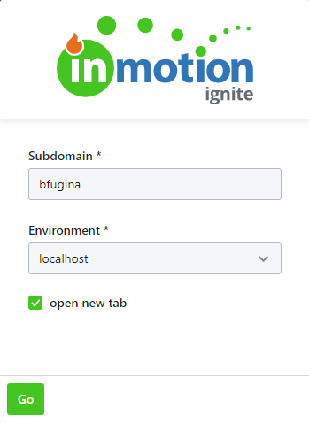

# About
  

Opus-Launcher is a popup [Chrome Extension](https://developer.chrome.com/extensions) that builds and navigates to an Opus URL.  
It has inputs for **Subdomain** and **Environmant** and a checkbox for opening the url in a new tab.  
It maintains its state across uses and keeps a history of used subdomains.

If the user is logged into Chrome, the extension will sync the state across multiple Chrome instances. If the user is not logged into Chrome, the state will only be maintained on the machine that it is running on.

# Installing the Chrome Extension

1. Build the extension.  
_The build result will be in the `build` directory in the project directory._  
     **`yarn build`**
2. Open the Chrome Extension Management page by navigating to `chrome://extensions`
3. Enable Developer Mode by clicking the toggle switch next to **Developer mode**.
4. Click the **LOAD UNPACKED** button and select the `build` directory.

See the Chrome Developer [Getting Started Tutorial](https://developer.chrome.com/extensions/getstarted) for more information.

# Development

This project was bootstrapped with [Create React App](https://github.com/facebook/create-react-app).

## Available Scripts

In the project directory, you can run:

### `npm start`

Runs the app in the development mode. 
Open [http://localhost:3000](http://localhost:3000) to view it in the browser.

The page will reload if you make edits. 
You will also see any lint errors in the console.

### `npm test`

Launches the test runner in the interactive watch mode. 
See the section about [running tests](https://facebook.github.io/create-react-app/docs/running-tests) for more information.

### `npm run build`

Builds the app for production to the `build` folder. 
It correctly bundles React in production mode and optimizes the build for the best performance.

The build is minified and the filenames include the hashes. 
Your app is ready to be deployed!

See the section about [deployment](https://facebook.github.io/create-react-app/docs/deployment) for more information.

### `npm run eject`

**Note: this is a one-way operation. Once you `eject`, you can’t go back!**

If you aren’t satisfied with the build tool and configuration choices, you can `eject` at any time. This command will remove the single build dependency from your project.

Instead, it will copy all the configuration files and the transitive dependencies (Webpack, Babel, ESLint, etc) right into your project so you have full control over them. All of the commands except `eject` will still work, but they will point to the copied scripts so you can tweak them. At this point you’re on your own.

You don’t have to ever use `eject`. The curated feature set is suitable for small and middle deployments, and you shouldn’t feel obligated to use this feature. However we understand that this tool wouldn’t be useful if you couldn’t customize it when you are ready for it.

## Learn More

You can learn more in the [Create React App documentation](https://facebook.github.io/create-react-app/docs/getting-started).

To learn React, check out the [React documentation](https://reactjs.org/).
